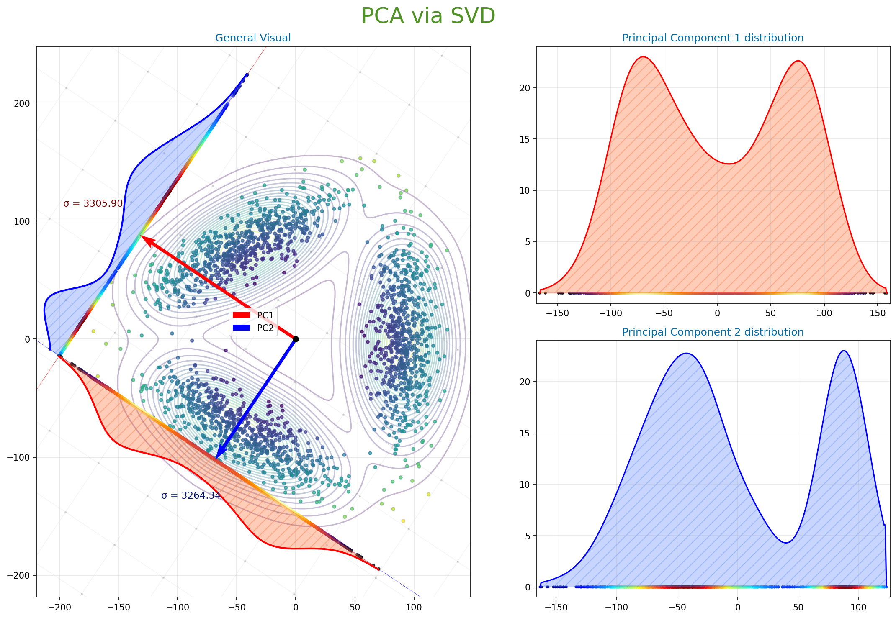
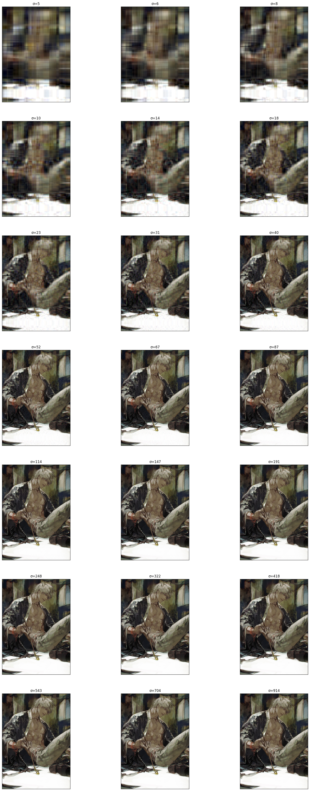

# PCA with Custom C-Optimized SVD

This project provides a high-performance implementation of **Principal Component Analysis (PCA)**. It bridges the gap between low-level efficiency and high-level data science by utilizing a custom-compiled C shared library for Eigendecomposition while maintaining the flexibility of Python (NumPy/PyTorch) for data manipulation.

---

## Key Features

* **Custom C Backend:** Implements the **QL Algorithm with Wilkinson shifts** for fast and numerically stable Eigendecomposition.
* **Performance Optimized:** Compiled with `-O3` and `-fPIC` to leverage CPU-level optimizations via a shared library (`libqr.so`).
* **Advanced Visualization:** Support for 2D/3D density projections, variance analysis, and image compression.
* **Hybrid Architecture:** Seamlessly integrates C-based math helpers with modern Python data stacks like PyTorch and Matplotlib.

---

## Project Structure

- `qr.c`: The core C source file containing the Wilkinson Symmetric QR/QL algorithms.
- `PCA_via_SVD.ipynb`: Demonstration of PCA on synthetic 2D datasets and high-dimensional variance visualization.
- `svd.ipynb`: Practical application of SVD for image processing and reconstruction.
- `utilities.py`: Helper functions for 3D plotting and data transformations.

---

## Visualizations

### 1. Principal Component Projections
Here we show how the algorithm identifies the axes of maximum variance in a synthetic dataset.

### 2. SVD-Based Image Reconstruction
Comparing original images against reconstructed versions using varying numbers of principal components.

